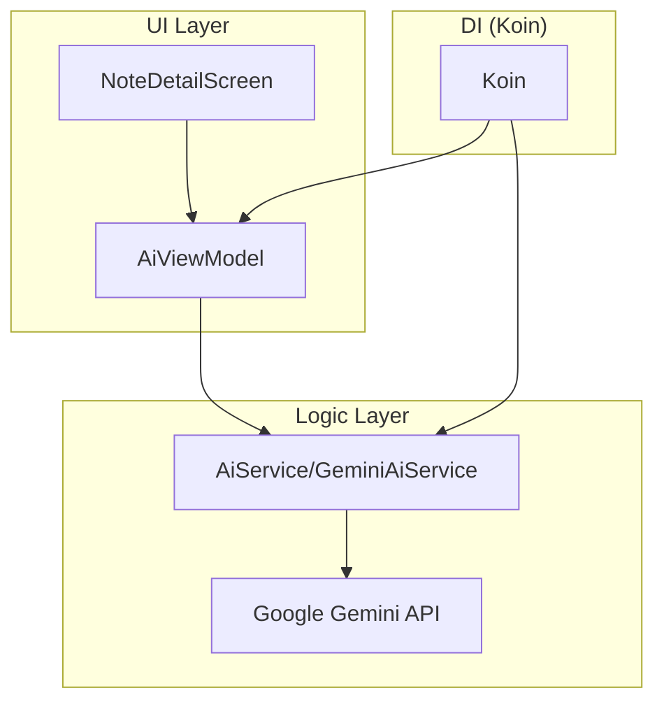

# NoteApp - Tugas 9 PAM (AI Integration)

A modern, cross-platform Note-Taking application built with **Compose Multiplatform**, now integrated with **Google Gemini AI** for smart note assistance.

## 🤖 AI Integration (Tugas 9)

Project ini telah mengintegrasikan fitur kecerdasan buatan menggunakan **Gemini AI** untuk membantu pengguna mengelola catatan mereka secara lebih efisien.

### Fitur Utama AI:
- **Smart Note Summarizer**: Meringkas isi catatan yang panjang menjadi ringkasan singkat dalam Bahasa Indonesia hanya dengan satu klik.
- **AI-Powered Title Suggestion**: Memberikan saran judul yang relevan berdasarkan isi konten catatan.
- **Responsive UI**: Dilengkapi dengan loading indicators (progress bar) dan penanganan error yang intuitif.

### Implementasi Teknis:
- **Model**: `Gemini 1.5 Flash` (via Google AI Studio).
- **SDK**: `dev.shreyaspatil.generativeai:generativeai-google` (Kotlin Multiplatform SDK).
- **Error Handling**: Implementasi `runCatching` dengan logika **fallback** untuk memastikan aplikasi tidak crash jika koneksi API bermasalah.
- **Prompt Engineering**: System prompt yang dirancang khusus untuk menghasilkan ringkasan dalam Bahasa Indonesia yang profesional namun mudah dipahami.

## 🏗️ Architecture & DI
Aplikasi ini menggunakan **Koin** untuk Dependency Injection, memisahkan logika AI ke dalam service layer yang bersih.

## 🛠️ Tech Stack
- **UI Framework**: Compose Multiplatform
- **Language**: Kotlin
- **Dependency Injection**: Koin
- **Database**: SQLDelight
- **AI API**: Google Gemini AI Studio

## 🚀 Cara Menjalankan Fitur AI
1. Dapatkan API Key dari [Google AI Studio](https://aistudio.google.com/).
2. Masukkan API Key di file `composeApp/src/commonMain/kotlin/org/example/project/di/Koin.kt`.
3. Jalankan aplikasi pada Android Emulator atau Desktop.
4. Buka salah satu catatan dan klik tombol **"Summarize Note"** di bagian bawah.

## 📸 Screenshots
*(Pastikan file gambar tersedia di folder screenshots/)*

| Dashboard Notes | AI Summarizer |
| :---: | :---: |
|  |  |

---
**Tugas 9 - Pengembangan Aplikasi Mobile**
**Oleh: Jihwi (NoteApp Project)**
