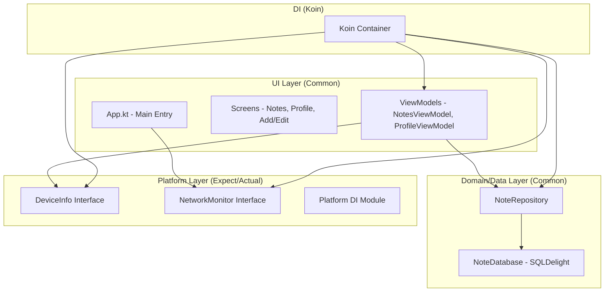

# NoteApp - Tugas 9 PAM (AI Integration)

A modern, cross-platform Note-Taking application built with **Compose Multiplatform**, now integrated with **Gemini AI** for smart note assistance.

## 🤖 AI Integration (Task 9)

### Features:
- **Smart Note Summarizer**: Automatically generate concise summaries for long notes using the Gemini 1.5 Flash model.
- **Responsive UI**: Interactive "AI Insights" section with loading indicators and proper error handling.
- **Koin DI Integration**: AI services and ViewModels are fully managed by Koin for efficient resource handling.
- **Well-designed System Prompt**: The AI is instructed to act as a professional Note Assistant, ensuring high-quality and relevant summaries.

### Technical Implementation:
- **API**: [Google Gemini API](https://ai.google.dev/) (Gemini 1.5 Flash).
- **SDK**: `dev.shreyaspatil.generativeai:generativeai-google` (Kotlin Multiplatform fork of official SDK).
- **Error Handling**: Graceful handling of network errors, empty content, and API limitations.

## 📸 Screenshots & Demo

| AI Summarizer (Loading) | AI Summary Result |
| :---: | :---: |
|  |  |

> **Note**: Demo video showing AI summarization in action can be found [here](video/demo_ai.mp4).

## 🏗️ Architecture Diagram (Updated)

The application uses a Clean Architecture approach with Koin as the central Dependency Injection container.

## 📸 Screenshots

| Device Info (Settings) | Network Indicator (Offline) |
| :---: | :---: |
|  |  |

## 🎥 Video Demo
A 45-second demo video showing Koin DI initialization, Device Info display, and real-time Network Status (On/Off) transitions can be found here:
**[Link to Video Demo](video/demo.mp4)**

---

## 🛠️ Tech Stack

-   **UI Framework**: [Compose Multiplatform](https://www.jetbrains.com/lp/compose-multiplatform/)
-   **Dependency Injection**: [Koin 4.0.0](https://insert-koin.io/)
-   **Database**: [SQLDelight](https://cashapp.github.io/sqldelight/)
-   **Navigation**: [Jetpack Navigation Compose](https://developer.android.com/jetpack/compose/navigation)

## 🏗️ Getting Started

### Prerequisites
- Android Studio Ladybug or later.
- JDK 17 or later.

### Running the App
- **Android**: Select `composeApp` and run on an emulator or device.
- **Desktop**: Run `./gradlew :composeApp:run`.
- **Web**: Run `./gradlew :composeApp:jsBrowserDevelopmentRun`.
