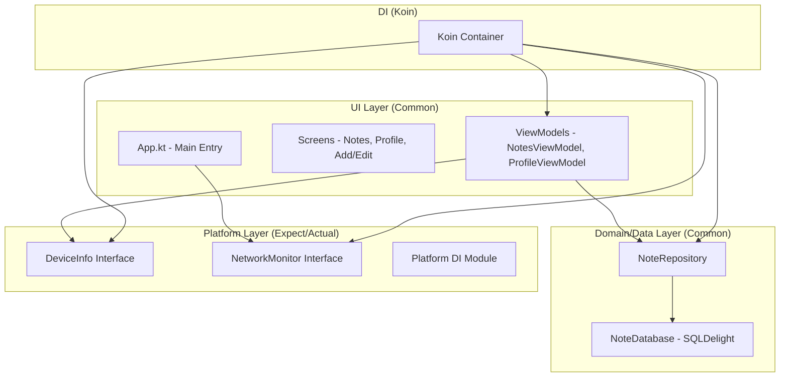

# NoteApp - Tugas 7 PAM

A modern, cross-platform Note-Taking application built with **Compose Multiplatform**, targeting Android, iOS, Desktop, and Web. This app demonstrates the usage of **SQLDelight** for local persistence and **Kotlin Multiplatform** for sharing logic across platforms.

## 🚀 Features

-   **Create, Read, Update, and Delete (CRUD) Notes**: Easily manage your daily thoughts.
-   **Search Functionality**: Quickly find notes by title or content.
-   **Favorites System**: Mark important notes as favorites for quick access.
-   **Dark Mode Support**: Seamlessly toggle between light and dark themes.
-   **Multiplatform**: Shared business logic and UI across Android, iOS, Desktop, and Web.
-   **Dependency Injection**: Powered by **Koin** for clean and maintainable code.
-   **Platform Features**: Access to platform-specific information (Device Name, OS Version) and Network Status monitoring.
-   **Modern UI**: Built using Material 3 components with a clean and intuitive design.

## 🏗️ Architecture

The app follows a clean architecture pattern, leveraging Kotlin Multiplatform to share most of the logic.



## 🛠️ Tech Stack

-   **UI Framework**: [Compose Multiplatform](https://www.jetbrains.com/lp/compose-multiplatform/)
-   **Dependency Injection**: [Koin](https://insert-koin.io/)
-   **Database**: [SQLDelight](https://cashapp.github.io/sqldelight/)
-   **Concurrency**: [Kotlin Coroutines](https://kotlinlang.org/docs/coroutines-overview.html)
-   **Date & Time**: [kotlinx-datetime](https://github.com/Kotlin/kotlinx-datetime)
-   **Navigation**: [Jetpack Navigation Compose](https://developer.android.com/jetpack/compose/navigation)

## 📸 Screenshots & Demo

| Device Info | Network Status Indicator |
| :---: | :---: |
|  |  |

> **Note**: Demo video showing DI, device info, and network status transitions can be found [here](video/demo.mp4).

## 📊 Database Schema

The application uses **SQLDelight** for local database management. Below is the schema for the `NoteEntity` table:

```sql
CREATE TABLE NoteEntity (
    id INTEGER NOT NULL PRIMARY KEY AUTOINCREMENT,
    title TEXT NOT NULL,
    content TEXT NOT NULL,
    isFavorite INTEGER NOT NULL DEFAULT 0,
    createdAt INTEGER NOT NULL
);
```

### Queries included:
- `getAllNotes`: Fetch all notes ordered by creation time.
- `getFavoriteNotes`: Fetch only notes marked as favorite.
- `searchNotes`: Search notes by title or content matching a query.
- `insertNote`: Add a new note or update an existing one.
- `deleteNote`: Remove a note by its ID.

## 📸 Screenshots

*(Note: Please ensure your screenshot images are placed in a folder named `screenshots` in the root directory for the links below to work on GitHub)*

| Notes List | Edit Note | Profile |
| :---: | :---: | :---: |
|  |  |  |

---

## 🏗️ Getting Started

### Prerequisites
- Android Studio Ladybug or later.
- JDK 17 or later.

### Running the App
- **Android**: Select `composeApp` and run on an emulator or device.
- **Desktop**: Run the `./gradlew :composeApp:run` command.
- **Web**: Run the `./gradlew :composeApp:jsBrowserDevelopmentRun` command.
