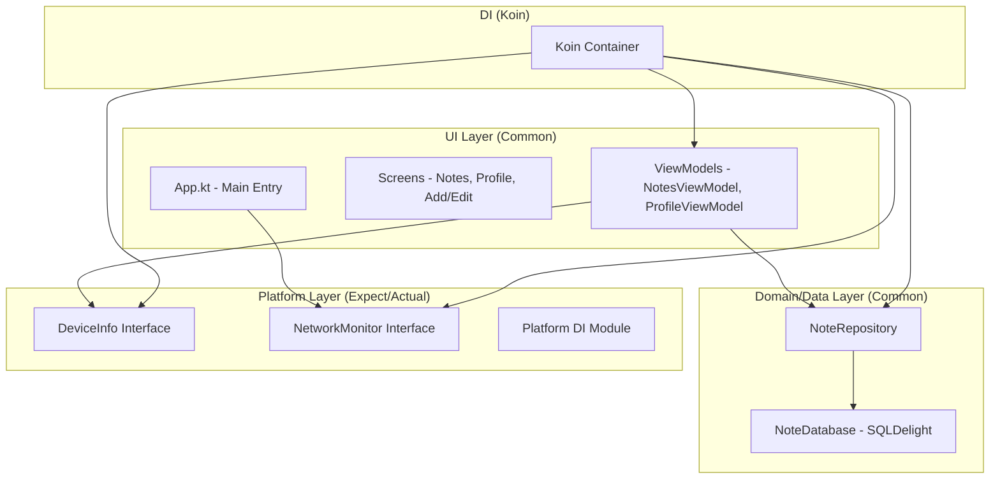

# NoteApp - Tugas 8 PAM (Platform Features & DI)

A modern, cross-platform Note-Taking application built with **Compose Multiplatform**, upgraded with Dependency Injection and Platform-specific features.

## 🚀 Upgrade Features (Task 8)

1.  **Koin Dependency Injection**: Full app migration to Koin DI. All components (Repository, ViewModels, Platform Services) are now managed and injected through Koin.
2.  **Platform DeviceInfo**: Implementation of `DeviceInfo` using `expect`/`actual` to retrieve device name, OS, and version across Android, iOS, JVM, and Web.
3.  **Real-time NetworkMonitor**: Implementation of `NetworkMonitor` using `expect`/`actual` to track internet connectivity status.
4.  **Settings Integration**: Device information is dynamically displayed on the Profile/Settings screen.
5.  **Network Status Indicator**: A prominent "Offline Mode" indicator appears on the main screen when the device loses connection.
6.  **Koin-injected ViewModels**: ViewModels are provided using `koinViewModel()` from the `io.insert-koin:koin-compose-viewmodel` library.

## 🏗️ Architecture Diagram

The application uses a Clean Architecture approach with Koin as the central Dependency Injection container.

## 📸 Screenshots

| Device Info (Settings) | Network Indicator (Offline) |
| :---: | :---: |
|  |  |

## 🎥 Video Demo
A 45-second demo video showing Koin DI initialization, Device Info display, and real-time Network Status (On/Off) transitions can be found here:
**[Link to Video Demo](video/demo.mp4)**

---

## 🛠️ Tech Stack

-   **UI Framework**: [Compose Multiplatform](https://www.jetbrains.com/lp/compose-multiplatform/)
-   **Dependency Injection**: [Koin 4.0.0](https://insert-koin.io/)
-   **Database**: [SQLDelight](https://cashapp.github.io/sqldelight/)
-   **Navigation**: [Jetpack Navigation Compose](https://developer.android.com/jetpack/compose/navigation)

## 🏗️ Getting Started

### Prerequisites
- Android Studio Ladybug or later.
- JDK 17 or later.

### Running the App
- **Android**: Select `composeApp` and run on an emulator or device.
- **Desktop**: Run `./gradlew :composeApp:run`.
- **Web**: Run `./gradlew :composeApp:jsBrowserDevelopmentRun`.
